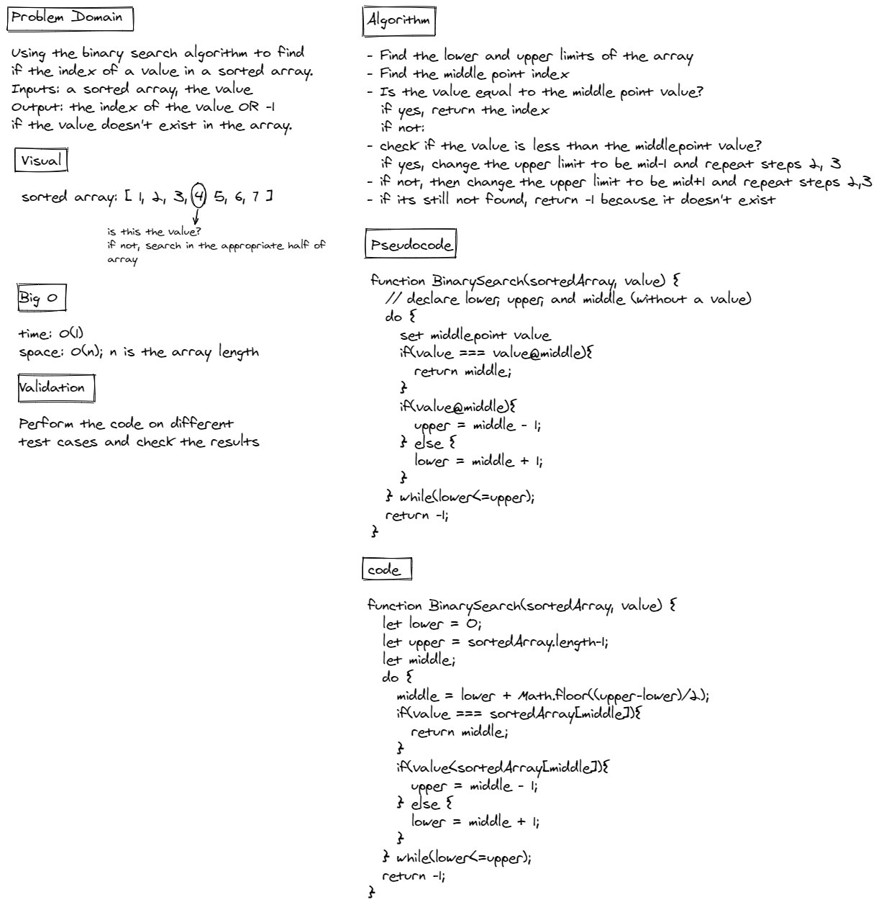

# Binary Search of Sorted Array

This is javascript-401d13 code challenge 03, it was to implement binary search for a sorted array.

## Whiteboard Process



## Approach & Efficiency

Code:

```
function BinarySearch(sortedArray, value) {
  let lower = 0;
  let upper = sortedArray.length-1;
  let middle;
  do {
    middle = lower + Math.floor((upper-lower)/2);
    if(value === sortedArray[middle]){
      return middle;
    }
    if(value<sortedArray[middle]){
      upper = middle - 1;
    } else { 
      lower = middle + 1;
    }
  } while(lower<=upper);
  return -1;
}
```

Binary search is a method of searching for values inside arrays that depends on comparing the value we search for with the value of the middle point of the array. If it wasn't equal to it, we check if the value is less/greater than the middle point value and re-do the process by re-setting the lower/upper limit of the array. 
Since the method depends on comparing values and uses limits, the array should be sorted.
