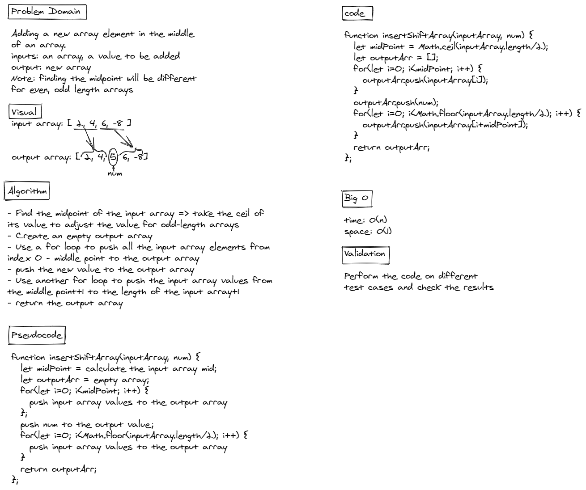

# Insert to Middle of an Array

This is javascript-401d13 code challenge 02, it was to write a code that takes an array and a value as inputs and adds the value in the middle of the array.

## Whiteboard Process



## Approach & Efficiency

Code:

```
function insertShiftArray(inputArray, num) {
  let midPoint = Math.ceil(inputArray.length/2);
  let outputArr = [];
  for(let i=0; i<midPoint; i++) {
    outputArr.push(inputArray[i]);
  }
  outputArr.push(num);
  for(let i=0; i<Math.floor(inputArray.length/2); i++) {
    outputArr.push(inputArray[i+midPoint]);
  }
  return outputArr;
};
```

The function takes two parameters: an array and a value.
We find the midpoint of the input array by dividing the length of it by 2. If the array length was odd, we take the ceil (the next integer) of the answer. Then we store the value in a variable called midpoint.
We create an empty output array and push the input array elements starting from index 0 up to the index before the midpoint. Then we push the input value we want to insert in the middle. Finally, we push the input array elements from index midpoint+1 up to the length of the input array+1 (because we are adding one element to that array).
