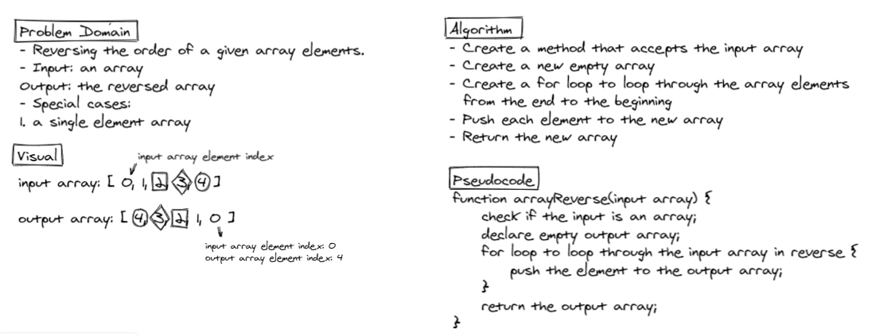
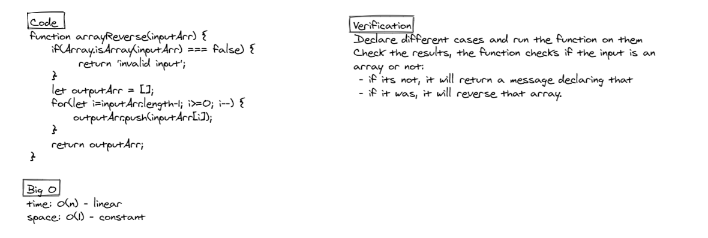

# Reverse an Array

The challenge was to write a code that takes an array as an input and reverses it.

## Whiteboard Process




## Approach & Efficiency

Code:

```
function arrayReverse(inputArr) {
    if(Array.isArray(inputArr) === false) {
         return 'invalid input)';
    }
    let outputArr = [];
    for(let i=inputArr.length-1; i>=0; i--) {
        outputArr.push(inputArr[i]);
    }
    return outputArr;
}
```

The function takes one argument as an input.
It checks if this input is an array or not. If it wasn't, it will cut it short and return a string that indicates an invalid input. If it was, the function will continue executing.
A new empty array is being created. Then a for loop will loop through the input array elements in a reversed order(from the last element to the first) and pushes each element to the new array.
Finally, the new output array will be returned.

So when this function is called, it should have an argument of an input array, and will return an output array of that input array reversed.
