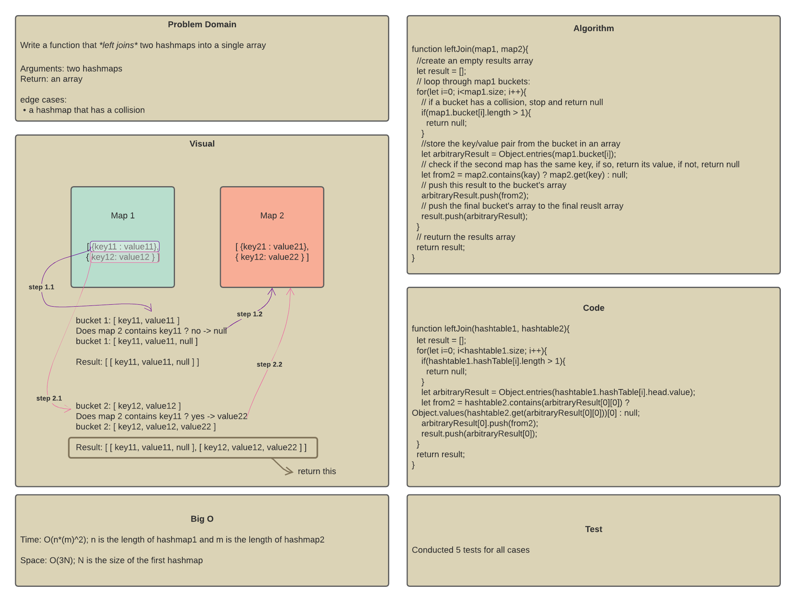
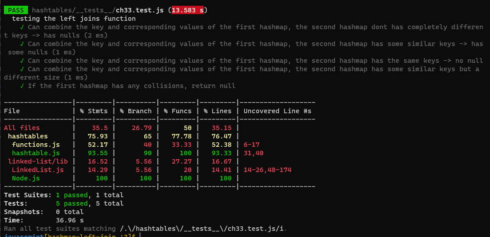

# Challenge 33 - hashmaps left join function

## Description

Write a function that *left joins* two hashmaps into a single array

Arguments: two hashmaps
Return: an array

## Approach

Left Join -> it will return an array that combines the key and corresponding values of the first hashmap, and the value of the key if it exists in the second hashmap or null. So the final array will have the length of the first hashmap, and each array within it will have 3 elements: a key, its corresponding value from hashmap1, and what is returned from hashmap2 (a value or null)

## Algorithm Steps

1. loop through the buckets of the first hashmap:
2. if it has collisions (more than one node) -> exit the function and return null
3. each node is a key/value object, so return the object entries in an array (the key and the value)
4. check if the second hashmap contains the current key or not:
5. if it does, return the value of that key from the second hashmap and push it to the array
6. if not, push null to the array
7. push the bucket's array to the final array
8. when the loop is done -> return the results array

## Code

```
function leftJoin(hashtable1, hashtable2){
  let result = [];
  for(let i=0; i<hashtable1.size; i++){
    if(hashtable1.hashTable[i].length > 1){
      return null;
    }
    let arbitraryResult = Object.entries(hashtable1.hashTable[i].head.value);
    let from2 = hashtable2.contains(arbitraryResult[0][0]) ? Object.values(hashtable2.get(arbitraryResult[0][0]))[0] : null;
    arbitraryResult[0].push(from2);
    result.push(arbitraryResult[0]);
  }
  return result;
}
```

## WhiteBoard



## Test Results


