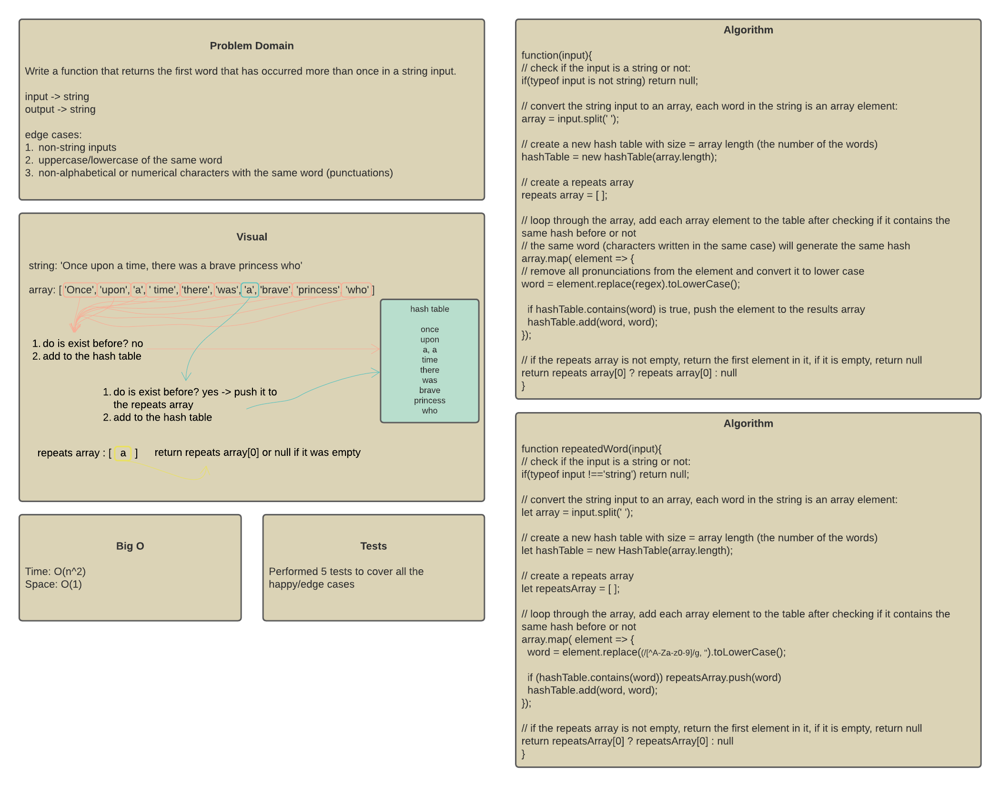
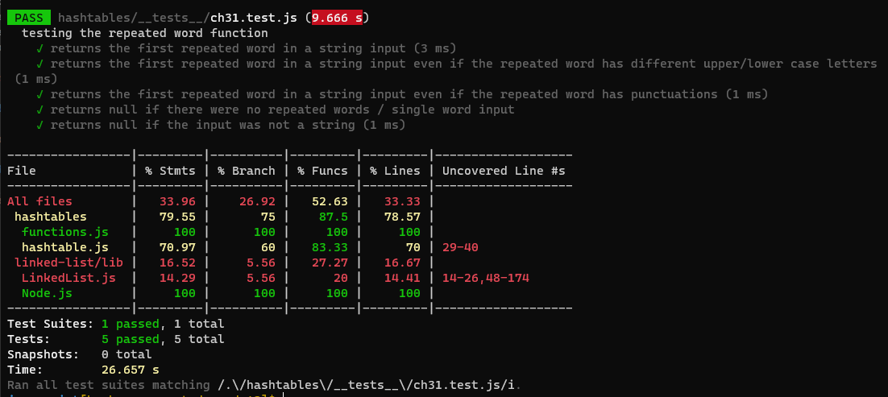

# Challenge 31 - repeated word function

## Description

Write a function called repeated word that finds the first word to occur more than once in a string
Arguments: string
Return: string

## Approach

A hashTable was used to solve the challenge because the hash code generated the same hash for the same input.

Steps:

1. covert the string input to an array, each word in the string is an element of the array
2. create a hashTable with size = array.length
3. loop through the array. Each word is a key. Use the hashTable `contains(key)` method to check if the hash already exists in the table or not, then use the `add(key, value)` method to add the word to the hashTable. When the `contains(key)` returns true, this means that the word (key) already exists in the table, so push that word to a repeated words array.
4. after looping, check the repeated words array. If it has elements in it, return the first element (at index 0); because it is the first repeated word. If it was empty, return null.

## WhiteBoard

## Test Results

