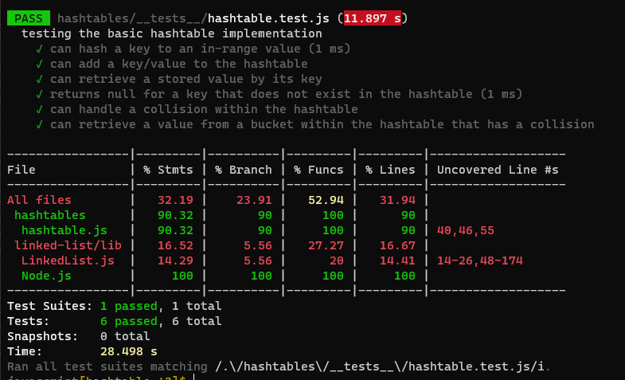

# Hash Tables

A hashtable is a data structure used to store data as key/value pairs.

A hashtable is traditionally created from an array. Each Index of the array is known as a bucket; since it can store multiple key/value pairs. To cover the case of collisions, buckets can be linked lists, arrays, or any other data structure.

The hashtable uses a hashing algorithm that encodes the key to map the value to a specific bucket in the array. In other words, the hash generates the index of the array’s bucket in which the value is stored.

## Challenge and API

The challenge was to implement a Hashtable Class with the following methods:

* **hash(key)** -> returns: the index for the key
* **add(key, value)** -> returns: nothing
* **get(key)** -> returns: the value associated with that key in the table
* **contains(key)** -> returns: a boolean, indicating if the key exists in the table already

## Approach

### The hashing method

It takes the key and turns it into an integer. The integer should be deterministic (the same key generates the same hash each time), as unique as possible, and within the table's size.

The algorithm used to create the hash:

1. Find the summation of each key character ASCII equivalent
2. Multiply the summation by a prime number (599 was used)
3. Use modulo to get the remainder of the result, when the multiplication is divided by the total size of the table

### The add method

This method:

1. hashes the key using the hash method
2. converts the key/value pair to a table entry (object)
3. adds them to the appropriate bucket in the table
4. handles collisions as needed

To handle collisions, every table bucket is a linked list; since linked lists can have one or more nodes appended to them.

### The get method

This method:

1. hashes the key using the hash method
2. checks if the index is empty or not. If it was empty it returns null, if not it continues
3. traverses through the bucket to find testing each node's value key. When it finds the key, it returns the node value (the key/value pair)
4. if the key doesn't exist in any node, it returns null

### contains method

1. hashes the key using the hash method
2. checks if the index is empty or not. If it was empty it returns false, if not it continues
3. traverses through the bucket to find testing each node's value key. When it finds the key, it returns true
4. if the key doesn't exist in any node, it returns false

## Efficiency

n is the hash table size
m is the bucket size, can be 1 if no collisions occurred

| Method | Time Efficiency | Space Efficiency |
|---|---|---|
| hash | O(1) | O(1) |
| add | O(1) | O(n) |
| get | O(m) | O(1) |
| contains | O(m) | O(1) |

## Testing

6 tests were conducted as the following:

