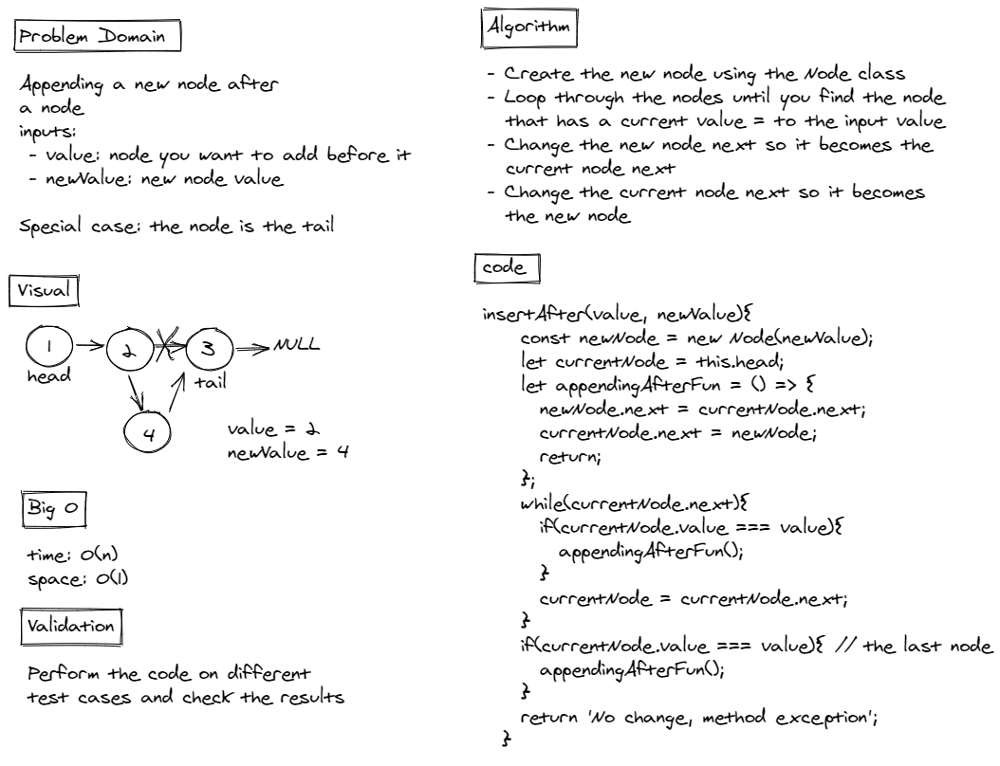

# Linked List Insertions

## Challenge Summary

A linked list is a dynamic data structure that represents a sequence of nodes connected to each other. Link lists are used to store data. They store nodes sequentially and nodes can be appended/removed from it.
For this linked list challenge, 3 methods were added:

1. `append(value)` - append a new node to the end of the list with O(1) time complexity.
2. `insertBefore(value, newValue)` - add a new node before an existing one.
3. `insertAfter(value, newValue)` - add a new node after an existing one.
4. `toString()` - to print the results of the linked list

## Links

* Node class .js link: https://github.com/hasnaa38/data-structures-and-algorithms/blob/main/javascript/linked-list/linked-list-insertions/lib/Node.js
* LinkedList js link: https://github.com/hasnaa38/data-structures-and-algorithms/blob/main/javascript/linked-list/linked-list-insertions/lib/LinkedList.js
* index.js link: https://github.com/hasnaa38/data-structures-and-algorithms/blob/main/javascript/linked-list/linked-list-insertions/index.js
* test link: https://github.com/hasnaa38/data-structures-and-algorithms/blob/main/javascript/linked-list/linked-list-insertions/__tests__/insertions.test.js

## Whiteboard Process

* `append(value)` Whiteboard Process


* `insertBefore(value, newValue)` Whiteboard Process


* `insertAfter(value, newValue)` Whiteboard Process



## Approach & Efficiency

* `append(value)`: time and space complexity: O(1)
* `insertBefore(value, newValue)` and `insertAfter(value, newValue)`: space is O(1), time is O(n) due to the loop

## Solution

console logging the results of the functions results with the following:

```
original linked list:
{ 1 } -> { 2 } -> { 3 } -> X
insert before the 2:
{ 1 } -> { 80 } -> { 2 } -> { 3 } -> X
insert after the 2:
{ 1 } -> { 80 } -> { 2 } -> { 300 } -> { 3 } -> X
```


