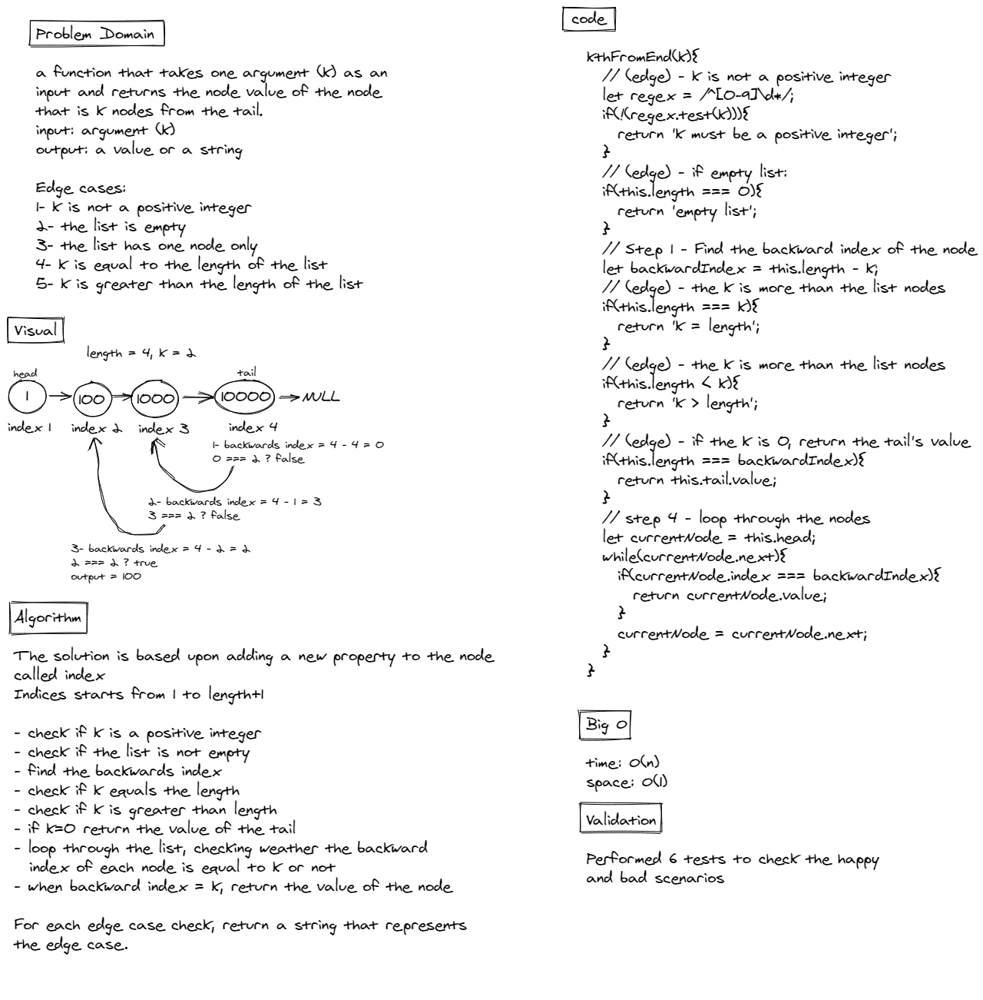
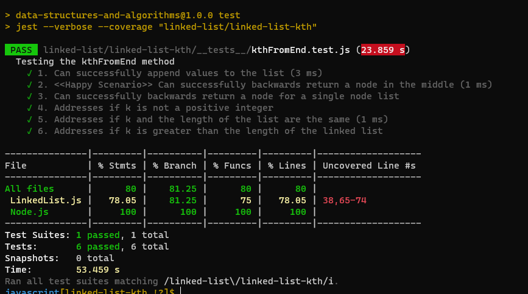

# Linked List Kth

## Challenge Summary

A linked list is a dynamic data structure that represents a sequence of nodes connected to each other. Link lists are used to store data. They store nodes sequentially and nodes can be appended/removed from it.
For this linked list challenge, only one new methods was added:

`kthFromEnd(k)` - finds the value of the k'th node from the tail.

## Link

PR: https://github.com/hasnaa38/data-structures-and-algorithms/pull/23

## Solution

The solution is based upon adding a new property to the node called index
Indices starts from 1 to length+1

Then, using the node's index and the list length we can find the backward index of each node and compare it to k

Edge cases the code covers:

1. k is not a positive argument
2. empty list
3. only one node in the list
4. k = length
5. k > length
6. k = 0

## Tests Results

