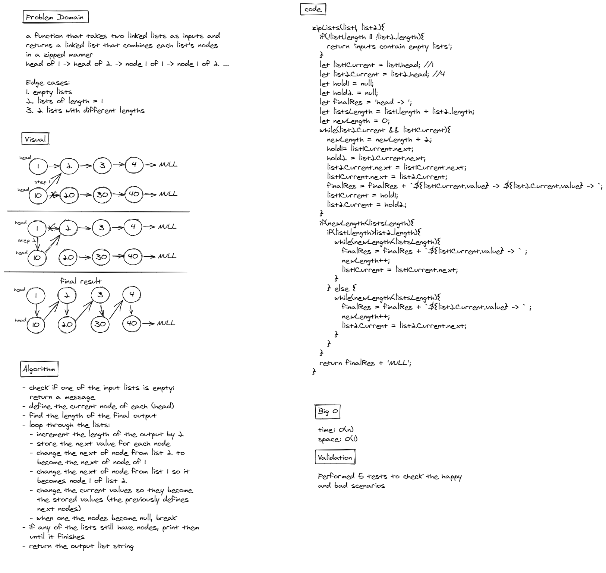

# Linked List zip

## Challenge Summary

Only one new method was added for todays challenge: `zipLists(list1, list2)`. The method takes 2 linked lists as inputs. The output is one linked list that combines the nodes of each list in a zipped manner:
head of list 1 -> head of list 2 -> node 1 of list 1 -> node 2 of list 2 -> node 3 of list 3 -> ...

## Whiteboard Process

## Approach & Efficiency

space is O(1), time is O(n) due to the loops

## Solution

The solution is based upon the idea of changing the next property of the nodes of each list so they point towards the next node of the other list.
The code covers the following edge cases:

1. empty lists
2. lists of length = 1
3. 2 lists with different lengths
