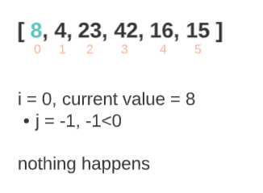
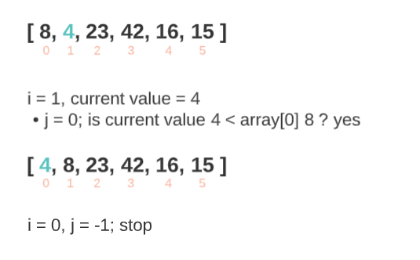
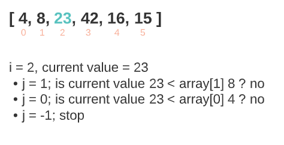
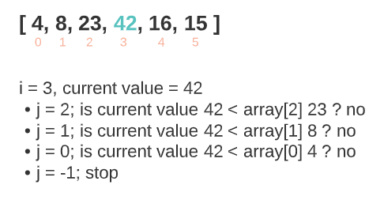
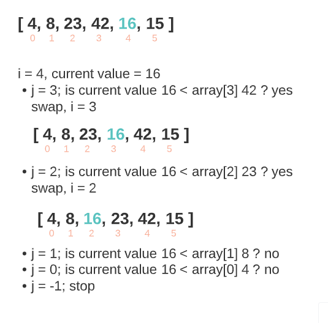
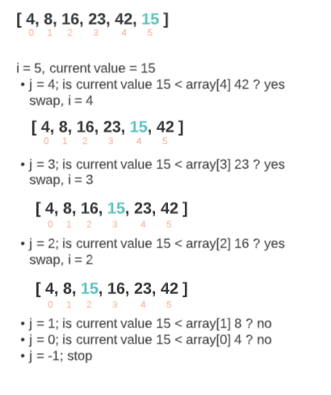
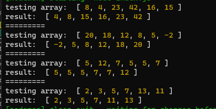
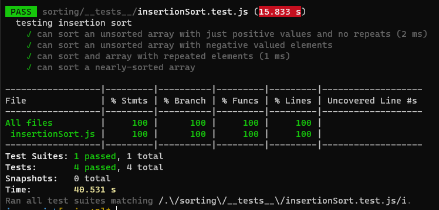

# Insertion Sort

Insertion Sort is a sorting algorithm that traverses a part of the array multiple times as it slowly builds out the sorting sequence. The traversal keeps track of the current value and compares it to all the values to its left, if the current value is less than a value to its left, it will swap the two values. This will result with an incrementally sorted array.

## Trace

**Sample array**: `[ 8, 4, 23, 42, 16, 15 ]`

**Expected result**: `[ 4, 8, 15, 16, 23, 42 ]`

### Pass 1



Throughout the first pass, nothing will happen because we are at index 0 which has no other elements to its left.

### Pass 2



Throughout the second pass, the element at the index 1 will be compared to the only element to its left, which is the element at index 0:

* if the element at index 1 was less than the element at index 0; the two will swap
* if not, nothing will happen

### Pass 3



Throughout the third pass, the element at the index 2 will be compared to the elements at index 1 and 0:

1. Comparing to the element at index 1:

    * if the element at index 2 was less than the element at index 1; the two will swap and we will be at index 1
    * if not, nothing will happen

2. Comparing to the element at index 0:

    * if the element at index 2/1 (depends wether it was changed at step 1 or not) was less than the element at index 0; the two will swap and we will be at index 1/0
    * if not, nothing will happen

### Pass 4



Throughout the fourth pass, the element at the index 3 will be compared to the elements at the indices 2, 1 and 0, the same way it was happening at the previous passes:

* if the element at index 3 was less than the element at an index to its left; swap the two change the index
* if not, nothing will happen

### Pass 5



Throughout the fourth pass, the element at the index 4 will be compared to the elements at the indices 3, 2, 1 and 0, the same way it was happening at the previous passes:

* if the element at index 4 was less than the element at an index to its left; swap the two change the index
* if not, nothing will happen

### Pass 6



Throughout the fourth pass, the element at the index 5 will be compared to the elements at the indices 4, 3, 2, 1 and 0, the same way it was happening at the previous passes:

* if the element at index 5 was less than the element at an index to its left; swap the two change the index
* if not, nothing will happen

## Pseudo-code

```
insertionSort(array){
    for i = 0 incrementing to array.length {
        let current value = value at i
        for j = i-1 decrementing to 0 {
            if current value is less then the value at j the swap the two values and change i (the index of the current value) so it becomes j (since they swapped positions)
        }
    }
    return the array
}
```

## Code

```
function insertionSort(array){
  for(let i=0; i<array.length; i++){
    let currentValue = array[i];
    for(let j=i-1; j>=0; j--){
      if(currentValue < array[j]){
        array[i] = array[j];
        array[j] = currentValue;
        i = j;
      }
    }
  }
  return array;
}
```

## Results



## Tests



## Efficiency

### Time: O(n^2)

The worst case scenario for this algorithm is at index n (array.length-1) which will loop n * (n-1) number of times.

### Space: O(1)

No additional space is being created. This array is being sorted in place…keeping the space at constant O(1).
