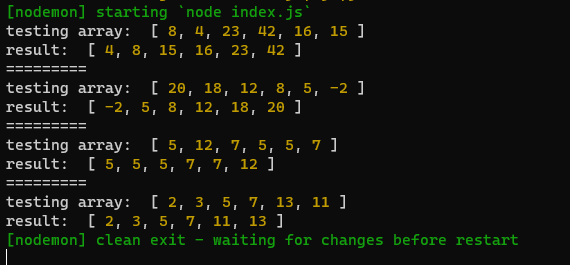

# Insertion Sort

Merge sort is a *Divide and Conquer* sorting algorithm. It divides the input array into two halves, calls itself for the two halves, and then merges the two sorted halves. It also uses another merge helper function to merge the sorted sub-arrays (halves) into one.

## Trace

**Sample array**: `[ 8, 4, 23, 42, 16, 15 ]`

**Expected result**: `[ 4, 8, 15, 16, 23, 42 ]`

### The Merge Sort Function


This is a recursive function that we use to divide the array into smaller arrays until each element in the original array is an individual array.

### The Merge Helper Function (Sorted Merge)


The helper function is being called for the fist time after dividing all the arrays in the recursive function so it will be run for 2 individual arrays. It sorts them and returns a sorted array of 2 elements, then it will be executed again by the other recursive function on the resultant sorted array and another individual array. This process keeps running; merging and sorting individual itemed arrays to already sorted arrays until merging the last 2 sorted arrays. As a result, when coding this function it is assumed to have sorted array arguments.

* A figure the describe the whole process:


## Pseudo-code

```
ALGORITHM Mergesort(arr)
    DECLARE n <-- arr.length

    if n > 1
      DECLARE mid <-- n/2
      DECLARE left <-- arr[0...mid]
      DECLARE right <-- arr[mid...n]
      // sort the left side
      Mergesort(left)
      // sort the right side
      Mergesort(right)
      // merge the sorted left and right sides together
      Merge(left, right, arr)

ALGORITHM Merge(left, right, arr)
    DECLARE i <-- 0
    DECLARE j <-- 0
    DECLARE k <-- 0

    while i < left.length && j < right.length
        if left[i] <= right[j]
            arr[k] <-- left[i]
            i <-- i + 1
        else
            arr[k] <-- right[j]
            j <-- j + 1

        k <-- k + 1

    if i = left.length
       set remaining entries in arr to remaining values in right
    else
       set remaining entries in arr to remaining values in left
```

## Code

```
function _mergeSort(array){
  let n = array.length;
  if(n>1){
    let mid = Math.floor(n/2);
    let left = array.slice(0, mid);
    let right = array.slice(mid);
    _mergeSort(left);
    _mergeSort(right);
    mergeSorted(left, right, array);
  }
  return array;
}

function mergeSorted(left, right, array){
  // This function merges two sorted arrays
  let leftIndex = 0;
  let rightIndex = 0;
  let arrayIndex = 0;
  while(leftIndex < left.length && rightIndex < right.length){
    if(left[leftIndex] <= right[rightIndex]){
      array[arrayIndex] = left[leftIndex];
      leftIndex++;
    } else {
      array[arrayIndex] = right[rightIndex];
      rightIndex++;
    }
    arrayIndex++;
  }
  if(leftIndex === left.length) {
    // if all the values were taken from the left array and the right has any more values -> push them to the end
    while(arrayIndex < array.length){
      array[arrayIndex] = right[rightIndex];
      rightIndex++;
      arrayIndex++;
    }
  } else {
    while(arrayIndex < array.length){
      array[arrayIndex] = left[leftIndex];
      leftIndex++;
      arrayIndex++;
    }
  }
}
```

## Results



## Tests


## Efficiency

* **Time**: O(nlog(n))

* **Space**: O(1)
