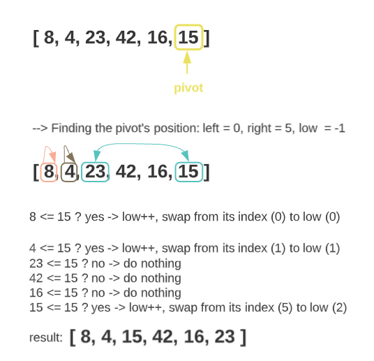

# Insertion Sort

Quick sort is a highly efficient sorting algorithm for large-sized data sets. It is based on partitioning of an array into smaller arrays. A large array is partitioned into two arrays one of which holds values smaller than the pivot, and another array holds values greater than the pivot. After partitioning the array, quick sort calls itself recursively twice to sort the two resulting sub-arrays.

## Trace

**Sample array**: `[ 8, 4, 23, 42, 16, 15 ]`

**Expected result**: `[ 4, 8, 15, 16, 23, 42 ]`

### Process

1. Select a pivot for the array; the last element in the array for this example
2. Sort the elements of the array (the partitioning function):
    * Elements to the left of the pivot are smaller than the pivot
    * Elements to the right are greater than the pivot This process is called
    * if an element is equal to the pivot, it will go to the left
3. Repeat the process for the left and right side of the pivot, until the array is sorted.

#### Positioning the pivot



#### Sorting the left of the pivot


#### Sorting the right of the pivot


## Pseudo-code

```
ALGORITHM QuickSort(arr, left, right)
    if left < right
        // Partition the array by setting the position of the pivot value
        DEFINE position <-- Partition(arr, left, right)
        // Sort the left
        QuickSort(arr, left, position - 1)
        // Sort the right
        QuickSort(arr, position + 1, right)

ALGORITHM Partition(arr, left, right)
    // set a pivot value as a point of reference
    DEFINE pivot <-- arr[right]
    // create a variable to track the largest index of numbers lower than the defined pivot
    DEFINE low <-- left - 1
    for i <- left to right do
        if arr[i] <= pivot
            low++
            Swap(arr, i, low)

ALGORITHM Swap(arr, i, low)
    DEFINE temp;
    temp <-- arr[i]
    arr[i] <-- arr[low]
    arr[low] <-- temp
```

## Code

```
function _quickSort(array, left, right){
  if(left<right){
    let position = partition(array, left, right); //pivot
    _quickSort(array, left, position-1);
    _quickSort(array, position+1, right);
  }
  return array;
}

function partition(array, left, right){
  let pivot = array[right];
  let low = left - 1;
  for(let i = left; i<=right; i++){
    if(array[i] <= pivot){
      low++;
      swap(array, i, low);
    }
  }
  return low;
}

function swap(array, i, low){
  let temp = array[i];
  array[i] = array[low];
  array[low] = temp;
}
```

## Results


## Tests


## Efficiency

### Time: O(n^2)

### Space: O(1)
