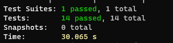

# Stacks and Queues

A **stack** is a container of nodes that are inserted and removed according to the *last-in first-out (LIFO)* principle.

A **queue** is a container of nodes that are inserted and removed according to the *first-in first-out (FIFO)* principle.

## Challenge

The challenge was to implement a basic stack and queue classes.

## API

three js files were added for this challenge:

1. *Node.js* - it has a value and next pointer properties
2. *Stack.js* - it hat has a top property and contains the following methods:
    * `push(value)` - to add a new node with that value to the top of the stack. It returns the value from node from the top of the stack
    * `pop()` - to remove a node from the top of the stack. It returns the value from node from the top of the stack
    * `peek()` - to return the value of the node located at the top of the stack
    * `isEmpty()` - it return boolean indicating whether or not the stack is empty.

    

3. *Queue.js* - it has a front property and contains the following methods:
    * `enqueue(value)` - to add a new node with that value to the back of the queue.
    * `dequeue()` - to remove the node from the front of the queue. It returns the queue front value.
    * `peek()` - to return the value of the node located at the front of the queue
    * `isEmpty()` - it returns a boolean indicating whether or not the queue is empty

    

## Approach & Efficiency

* The add methods took one argument (value), which was used to create a new node instance. This node was then added to the stack/queue.
* All the methods use the `isEmpty()` method to raise exception when called on empty stack/queue.
* All the functions written for this challenge have an O(1) time complexity.

## Testing

14 tests were conducted to check the following:

* It can successfully push onto a stack
* It can successfully push multiple values onto a stack
* It can successfully pop off the stack
* It can successfully empty a stack after multiple pops
* It can successfully peek the next item on the stack
* It can successfully instantiate an empty stack
Calling pop or peek on empty stack raises exception
* It can successfully enqueue into a queue
* It can successfully enqueue multiple values into a queue
* It can successfully dequeue out of a queue the expected value
* It can successfully peek into a queue, seeing the expected value
* It can successfully empty a queue after multiple dequeues
* It can successfully instantiate an empty queue
calling dequeue or peek on empty queue raises exception

Test result:

