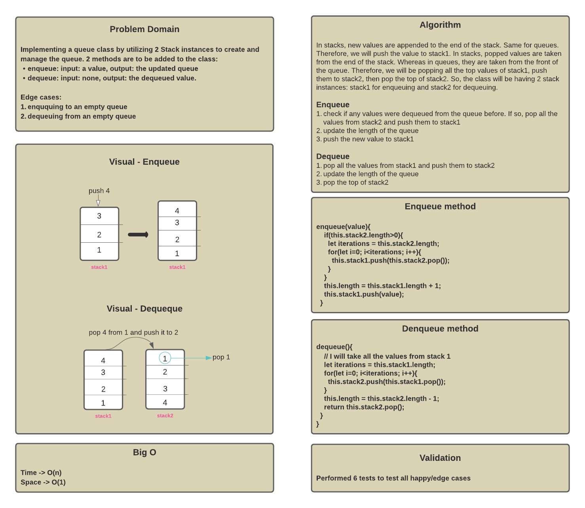

# Pseudo Queues

Both stacks and queues are data structures in which we append elements, which is to say, we add them to the end. With **stacks**, we add items to the end and remove them from the end, but with **queues** we add to the end but remove from the beginning.

## Challenge

The challenge is to implement a new queue class by utilizing 2 Stack instances to create and manage the queue. 2 methods were added to that class:

* `enqueue(value)` - to add a new node with that value to the queue using a first-in, first-out approach.
* `dequeue()` - to remove the node from the front of the queue using a first-in, first-out approach. It returns the queue front value.

## Whiteboard

## Efficiency

Since both methods include a loop -> time efficiency is O(n). However, space efficiency is still O(1)

## Testing

6 tests were conducted as the following:

Test results:

