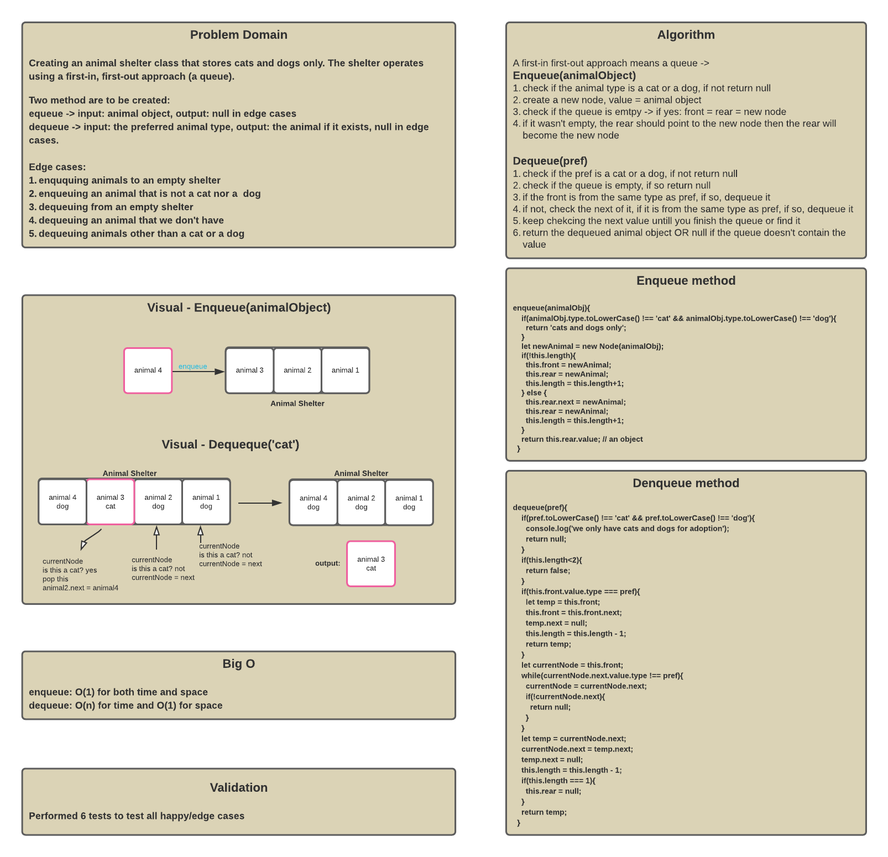
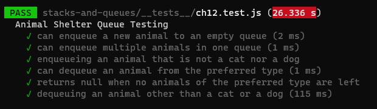
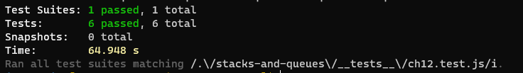

# Animal Shelter Queue

A **queue** is a container of nodes that are inserted and removed according to the *first-in first-out (FIFO)* principle.

## Challenge

Creating an AnimalShelter class that holds only dogs and cats. The shelter operates using a first-in, first-out approach (thats why its a queue).

The class implements the following methods:

* `enqueue(animalObject)` - receives one argument: animal object. it adds animals to the queue using a first-in, first-out approach.
* `dequeue(preferred)` - receives one argument: preferred string. It pops the first animal in the queue that is from the same preferred type and returns it to the user. If the preferred type was neither cats or dogs it will return null. If the animal doesn't exist. it will return null.

## Link

* [code](https://github.com/hasnaa38/data-structures-and-algorithms/blob/main/javascript/stacks-and-queues/lib/AnimalShelter.js)
* [test](https://github.com/hasnaa38/data-structures-and-algorithms/blob/main/javascript/stacks-and-queues/__tests__/ch12.test.js)

## Whiteboard

## Efficiency

enqueue -> O(1) for time and space.
dequeue -> O(n) for time, O(1) for space.

## Testing

6 tests were conducted as the following:

Test results:

