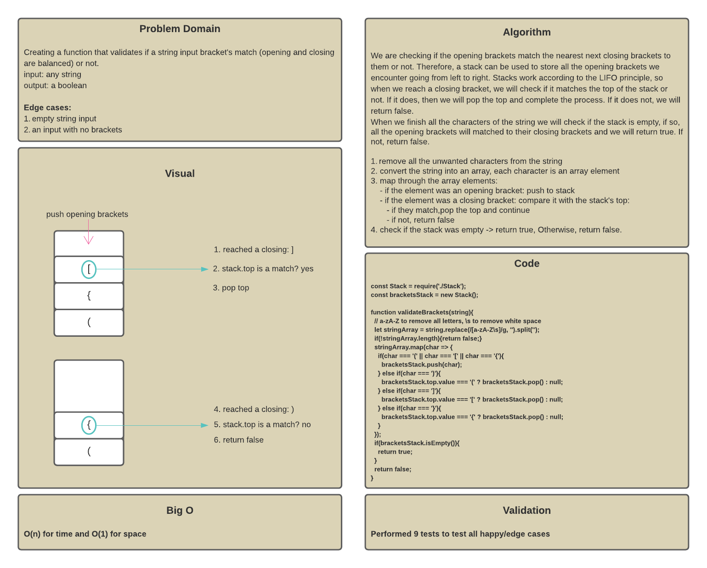
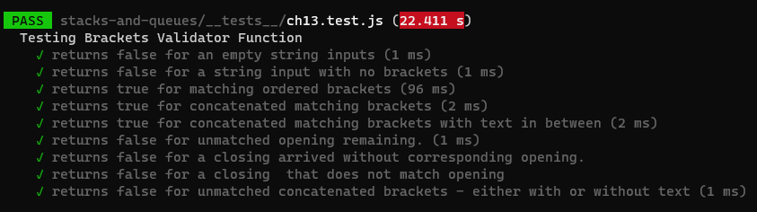
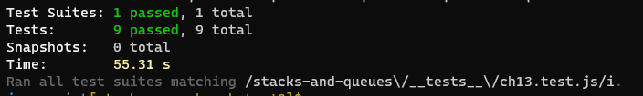

# Brackets Validator

## Challenge

Creating a function that validates if a string input bracket's match (are balanced) or not.

For a bracket to be balanced, each opening should have a closing of the same kind. If we have multiple brackets, and going from left to right, the last opening bracket should have the first closing bracket. This means that a stack can be used for this function; since stacks work in a LIFO style.

All opening brackets should be pushed to the stack. If we reach a closing bracket, we check the top of the stack, if it matches this closing, we can pop the opening and consider this pair of brackets balanced. Otherwise, the brackets will be considered mismatched and the function will return false.

If all the opening backers in the stack were matched to their closing bracket, the stack will be empty, so the function will return true. If the input started with a closing bracket, it will return false since it has no opening to be compared with.

## Whiteboard

## Efficiency

O(n) for time because we are mapping the characters
O(1) for space because it only returns true/false (even though the stack takes space?)

## Testing

9 tests were conducted as the following:

Test results:

