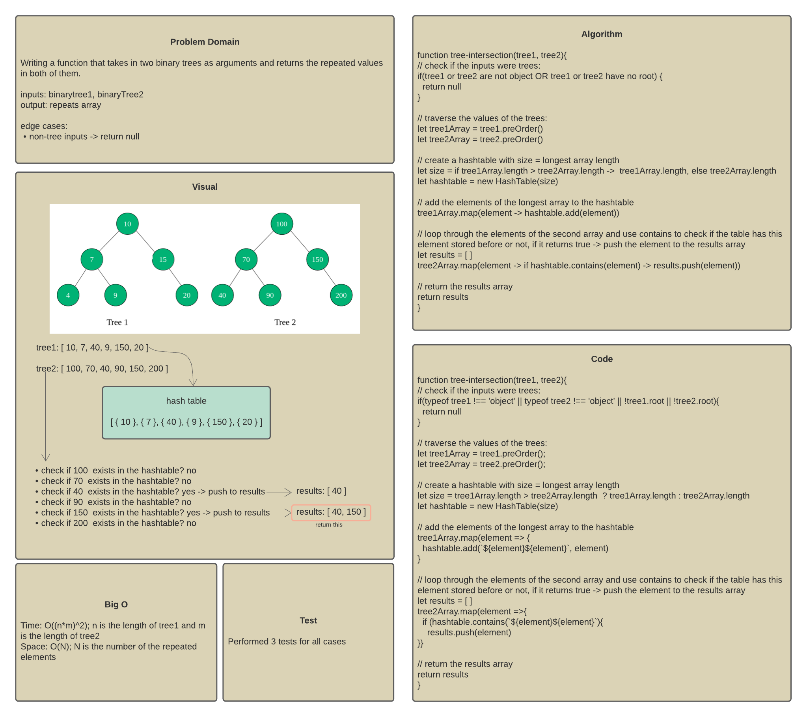
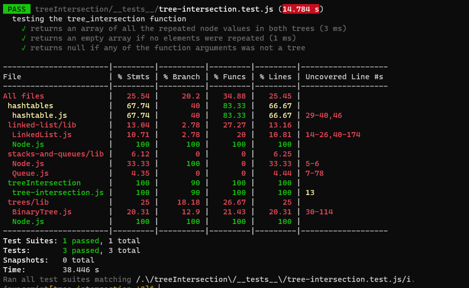

# Challenge 32 - tree intersection function

## Description

Write a function called `tree_intersection` that takes two binary trees as parameters, and return a set of values found in both trees.

## Approach

The algorithm works as the following:

1. it uses the binary tree `preOrder()` method to return an array of all the node values in the trees
2. it creates a hashtable in the size of the biggest tree
3. it uses the hashtable `add(key, value)` method to push all the elements of the biggest tree to the hashtable
4. it uses the hashtable `contains(key)` method to check if any elements of the second tree exists in the table or not. If so, the values will be pushed to a results array
5. the results array will be returned

## WhiteBoard

## Test Results

