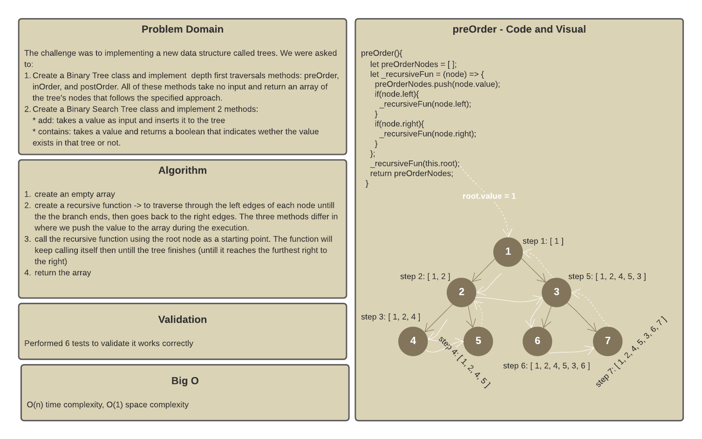
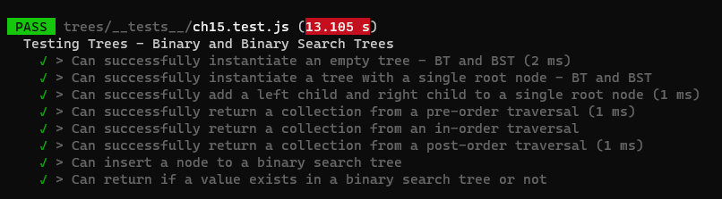
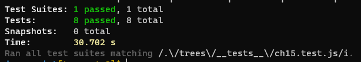

# Trees

A data structure that can be defined as a collection of nodes, where each node is a data structure consisting of a value and a list of references to nodes. The following figure shows the main tree concepts:

Trees can be:

* K-ary - each parent has maximum k children
* Binary - each parent has maximum 2 children (k=2)
* Binary Search - same as binary trees but nodes here are ordered by value

## Challenge

To implement binary and binary tree classes and create some basic methods.

For Binary Trees:

* Depth first traversals methods: `preOrder`, `inOrder`, `postOrder`.

For Binary Search Tree:

* Add method: takes a value as an input and returns nothing. Used to add a new node with that value in the correct location in the binary search tree.
* Contains: takes a value as an input and returns a boolean indicating whether or not the value is in the tree at least once.

## Approach & Efficiency

Binary Tree Efficiency: O(n) - it depends on the number of nodes of the tree
Binary Search Tree: O(log(n)) - it splits the tree in half

## Board

## Tests

