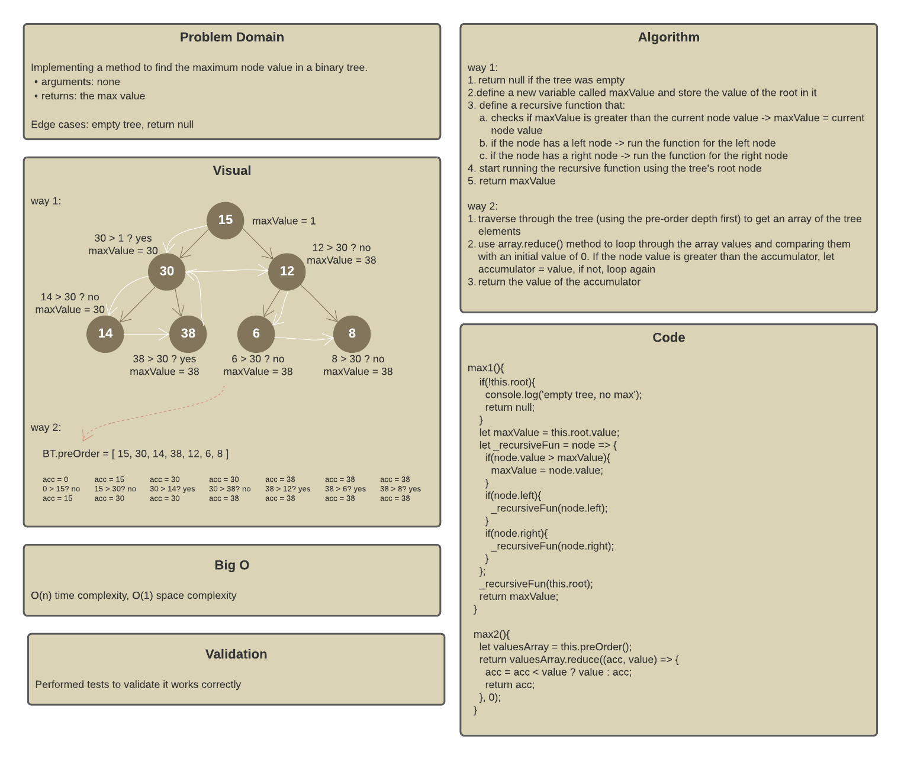
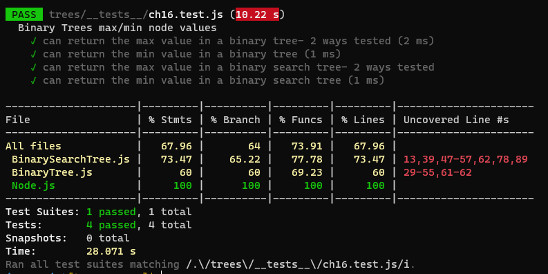

# Trees

A data structure that can be defined as a collection of nodes, where each node is a data structure consisting of a value and a list of references to nodes. The following figure shows the main tree concepts:

Trees can be:

* K-ary - each parent has maximum k children
* Binary - each parent has maximum 2 children (k=2)
* Binary Search - same as binary trees but nodes here are ordered by value

## Challenge

Implementing a method to find the maximum value stored in a tree. Arguments: none, returns: the max value.
Node values stored in the Binary Tree are assumed to be numeric.
This method was implemented in two ways, resulting in `max1()`, `max2()`.

Additionally, a method to find the minimum value in the tree was added `min()` for Binary Trees. Along with `max()` and `min()` methods for Binary Search Trees.

## Approach & Efficiency

Binary Tree:

* Time Efficiency: O(n); n is the number of the tree nodes
* Space efficiency: O(1)

Binary Search Tree:

* Time Efficiency: O(log(n))
* Space efficiency: O(1)

## Board

## Tests

