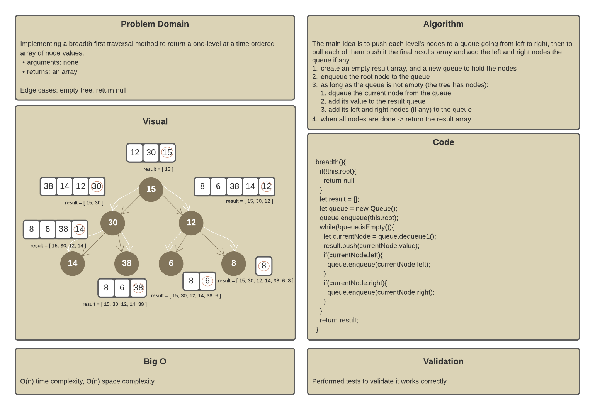
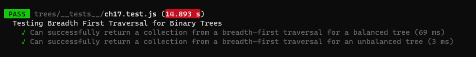
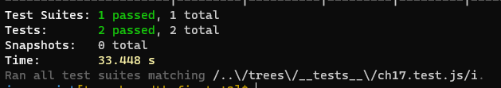

# Trees

A data structure that can be defined as a collection of nodes, where each node is a data structure consisting of a value and a list of references to nodes. The following figure shows the main tree concepts:

Trees can be:

* K-ary - each parent has maximum k children
* Binary - each parent has maximum 2 children (k=2)
* Binary Search - same as binary trees but nodes here are ordered by value

## Challenge

To implement a breadth first `breadth()` transverse method for a binary tree.

The solution uses a queue to store the nodes for each level and making use of the FIFO property to dequeue those nodes and store their values in our output array, also to enqueue the nodes of the next level.

## Approach & Efficiency

Time Efficiency: O(n), Space Efficiency: O(n)

## Board

## Tests

