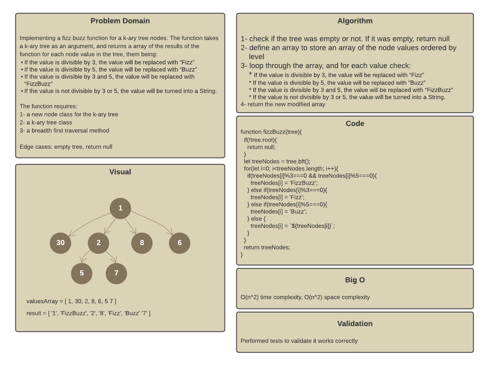
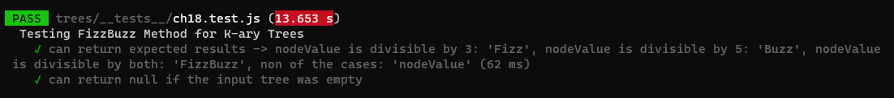
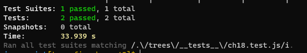

# Trees

A data structure that can be defined as a collection of nodes, where each node is a data structure consisting of a value and a list of references to nodes. The following figure shows a k-ary tree:

Trees can be:

* K-ary - each parent has maximum k children
* Binary - each parent has maximum 2 children (k=2)
* Binary Search - same as binary trees but nodes here are ordered by value

## Challenge

Implementing a `FizzBuzz(tree)` function for a k-ary tree nodes. The function takes a k-ary tree as an argument, and returns a array of the results of the function for each node value in the tree, them being:
If the value is divisible by 3, the value will be replaced with “Fizz”
If the value is divisible by 5, the value will be replaced with “Buzz”
If the value is divisible by 3 and 5, the value will be replaced with “FizzBuzz”
If the value is not divisible by 3 or 5, the value will be turned into a String.

The function requires:
1- a new node class for the k-ary tree: `Node Class`
2- a k-ary tree class: `KaryTree Class`
3- a breadth first traversal method: `bft()` method

## Approach & Efficiency

Time Efficiency: O(n^2), Space Efficiency: O(n^2)

## Board

## Tests

